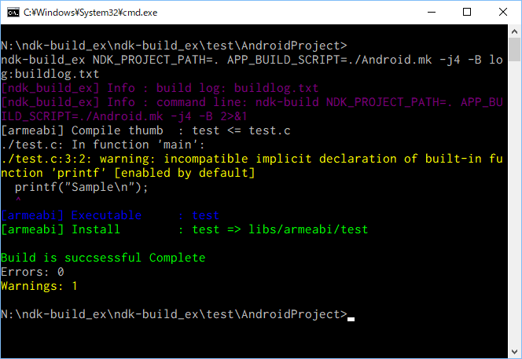

# ndk-build_ex

## What is this
 ndk-build.cmd wrapper for windows.

 In Windows envrioment, ndk-nuild don't support color text.

 this output the build log with color text like as linux terminal.

## function
 - output the build log with color text like as linux terminal.
 - output the build log to the textfile like as "tee".
 - count errors and warnigs.

## syntax
 `ndk-build_ex [ndk options] [log:\<path to the log file>]`

## build environment
 Visual studio 2015.

